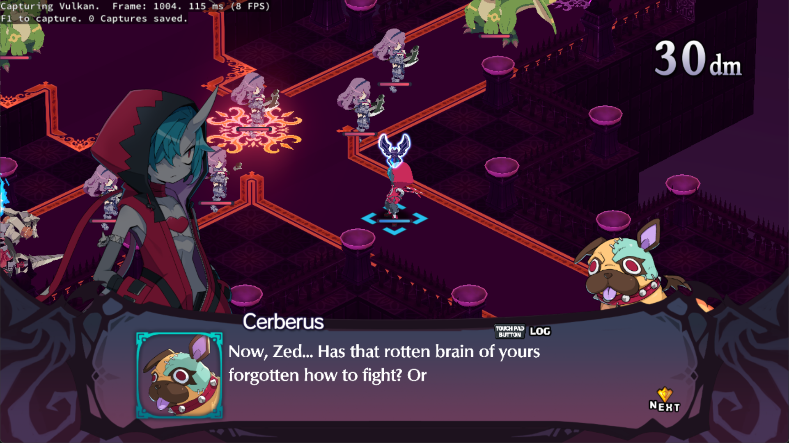
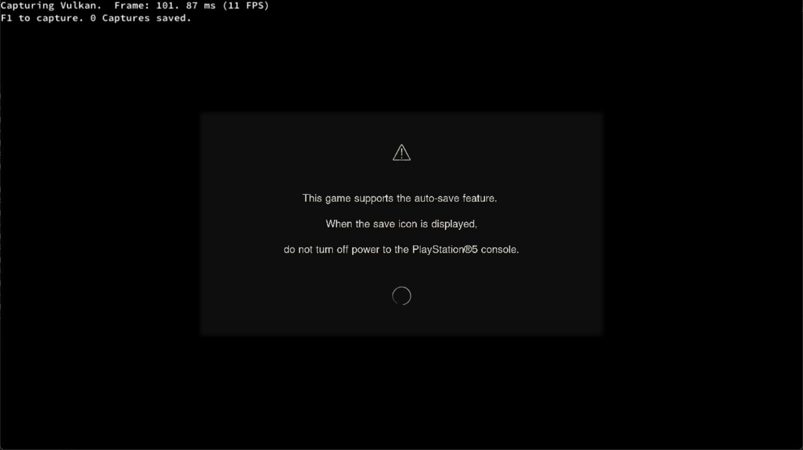

# KytyPlus

[](#system-requirements)
[](#current-status)
[](LICENSE)

**KytyPlus** is a KytyPS5-based PlayStation 5 emulator for Windows. This repository is a
standalone project derived from [KytyPS5](https://github.com/KytyPS5/KytyPS5) (itself based on
[Kyty](https://github.com/InoriRus/Kyty)), with additional work aimed at **crash/boot reach**,
**HLE sysmodules**, and **iGPU-friendly defaults**.

> [!CAUTION]
> **Experimental software.** Many games still crash, hang, black-screen, or render incorrectly.
> “Boots further” is not the same as “playable.” Do not expect AAA titles to run well.

---

## Disclaimers

### Affiliation and trademarks

- KytyPlus is **not affiliated with, endorsed by, or connected to** Sony Interactive Entertainment,
  PlayStation, or any Sony subsidiary.
- “PlayStation,” “PS5,” and related marks are trademarks of their respective owners.
- This project is an independent community emulator.

### Legal use only

- KytyPlus **does not include** games, game dumps, or Sony system firmware.
- Use **only** game files you have obtained **legally**.
- Do **not** ask maintainers for piracy links, firmware dumps, or copyrighted `sce_module` SPRXs.
- Distributing copyrighted dumps or firmware with this software is **illegal**

### Firmware / modules

- KytyPlus follows an **HLE-first** approach: many titles do **not** require external low-level
  firmware SPRX modules to start.
- That does **not** mean every API is implemented. Missing libraries, incomplete HLE, and GPU gaps
  are still common failure points.

### No warranty

- Provided **as-is**, without warranty of any kind.
- Builds may break saves, drivers, or performance expectations. Use at your own risk.
- Binary releases must remain accompanied by (or clearly linked to) the corresponding **source**
  under **GPL-2.0**.

### What this project is / is not

| Is | Is not |
|----|--------|
| A compatibility-oriented KytyPS5 derivative | An official Sony product |
| Aimed at fewer hard EXITs and better boot reach | A claim that games are “fixed” or playable |
| Windows + Vulkan focused | A finished, stable emulator |
| Tester-oriented (logs welcome) | A place to request illegal files |

---

## Current status

Windows x64 only. Vulkan 1.3 required.

Upstream KytyPS5 can already boot a range of 2D/3D titles (UE4/5, Unity, custom engines). KytyPlus
builds on that with focused changes such as:

- Safer paths around several graphics **EXIT** crash clusters (layered render targets, storage
  texture encoding/swizzle, texture-cache alias retirement, sampled depth cubes, etc.)
- **HLE** improvements for sysmodule load/unload state (soft-success for unknown IDs where safe)
- Defaults and allocator tweaks aimed at **integrated GPUs / UMA** (e.g. Radeon 780M-class)
- Present / pipeline-cache / shader-optimization adjustments for smoother local testing

Compatibility is still **early**. A title that no longer hits one known crash will often hit the
next unimplemented feature. Always test with a **fresh build** and attach logs when reporting.

---

## Screenshots

Screenshots below are from the KytyPS5 lineage and illustrate early boot capability — not KytyPlus
playability guarantees.

<table align="center">
  <tr>
    <td align="center">
      <strong>Disgaea 6</strong><br>
      
    </td>
    <td align="center">
      <strong>Dreaming Sarah</strong><br>
      
    </td>
  </tr>
  <tr>
    <td align="center">
      <strong>Minecraft Legends</strong><br>
      
    </td>
    <td align="center">
      <strong>SILENT HILL: The Short Message</strong><br>
      
    </td>
  </tr>
</table>

---

## System requirements

### Runtime

- Windows 10 (1803+) or Windows 11, **64-bit**
- CPU: x86-64
- GPU: **Vulkan 1.3** capable, with current drivers (AMD / NVIDIA / Intel)
- RAM: 16 GB minimum; **32 GB recommended** (especially on iGPU / UMA systems)

### What you need to run a game

- A **legally obtained** dumped game or demo directory, typically containing:
  - `eboot.bin` (Prospero ELF; sometimes named `.elf`)
  - Supporting files (`sce_sys`, data folders, etc. as required by the title)
- KytyPlus expects **Prospero / FreeBSD-OSABI** ELFs. Generic homebrew SDK ELFs with System V OSABI
  are often rejected (`elf is not valid` / `EI_OSABI != ELFOSABI_FREEBSD`).

---

## Install options

### Option A — Download a Release build (testers)

1. Open the repository **Releases** page.
2. Download the latest install zip (full `_Build/windows/install` tree — **not** a lone `.exe`).
3. Extract somewhere writable (example: `C:\KytyPlus\`).
4. Run `launcher.exe` or `kyty_emulator.exe` as described in [Running](#running).

> [!IMPORTANT]
> Under GPL-2.0, redistributed binaries must be paired with corresponding source availability.
> Prefer official project Releases that point at a git tag/commit.

### Option B — Build from source

#### Build dependencies

| Dependency | Notes |
|------------|--------|
| Git | Submodules required |
| CMake 3.12+ | On PATH |
| Ninja | On PATH |
| Visual Studio 2022 or Build Tools | **Desktop C++** + **C++ Clang tools for Windows** (`clang-cl`) |
| Qt 6 (MSVC 2022 64-bit) | Widgets, Network, Concurrent (e.g. `C:\Qt\6.10.3\msvc2022_64`) |
| Vulkan SDK | Provides `glslangValidator` (required at configure time) |

`cl.exe` alone is **not** supported — use **`clang-cl`**.

#### Configure and build

Open an **x64 Native Tools / Developer** shell for VS 2022, then:

```powershell
cd C:\path\to\KytyPlus

git submodule update --init --recursive

cmake -S src -B _Build/windows -G Ninja `
  -DCMAKE_BUILD_TYPE=Release `
  -DCMAKE_C_COMPILER=clang-cl `
  -DCMAKE_CXX_COMPILER=clang-cl `
  -DCMAKE_PREFIX_PATH="C:/Qt/6.10.3/msvc2022_64"

cmake --build _Build/windows --target launcher
cmake --install _Build/windows --prefix _Build/windows/install
```

Replace the Qt path with your installed version. After a successful install you should have:

```text
_Build\windows\install\launcher.exe
_Build\windows\install\kyty_emulator.exe
```

(plus Qt/runtime DLLs staged next to them)

#### Visual Studio Code

A CMake Tools setup lives in [`.vscode`](.vscode):

1. Install **CMake Tools** and **C/C++** extensions.
2. Set `CMAKE_PREFIX_PATH` in [`.vscode/settings.json`](.vscode/settings.json) to your Qt path.
3. Set `--game` in [`.vscode/launch.json`](.vscode/launch.json) for debugging.
4. Configure/build from an x64 VS developer environment.

---

## Running

Update GPU drivers before reporting graphics bugs.

### Graphical launcher

```powershell
.\_Build\windows\install\launcher.exe
```

1. Open global settings and add a folder that contains your dumped games.
2. The launcher searches recursively for directories with **`eboot.bin`**.
3. Select a game and run it.

### Command line

Game **directory** (loads `/app0/eboot.bin`):

```powershell
.\_Build\windows\install\kyty_emulator.exe --game "D:\Games\MyDump"
```

Specific **ELF** / `eboot.bin` (parent folder becomes `/app0`):

```powershell
.\_Build\windows\install\kyty_emulator.exe --game "D:\Games\MyDump\eboot.bin"
```

```powershell
.\_Build\windows\install\kyty_emulator.exe --game "D:\Games\MyDump\something.elf"
```

See all options:

```powershell
.\_Build\windows\install\kyty_emulator.exe --help
```

### Tips

- Keep dumps on a fast local disk; long paths and permission-locked folders cause avoidable pain.
- For bug reports, enable logging as needed and attach the **full** log, especially the final
  `--- Error ---` block and stack trace.
- iGPU / UMA systems: prefer recent AMD/Intel drivers; shared memory pressure is normal.

---

## Reporting bugs

1. Search existing issues first.
2. Include: game title, serial/title ID if known, KytyPlus commit or Release name, GPU/CPU/RAM, OS.
3. Attach the complete log file.
4. Describe exact steps (boot → menu → crash, etc.).

Expect crashes and incomplete features. Actionable reports with logs help more than “doesn’t work.”

---

## Contributing

- Prefer focused changes that build on Windows with the documented toolchain.
- Open an issue before large redesigns.
- Keep PRs reviewable; include tests when practical.

### Formatting

```powershell
python -m pip install pre-commit
python -m pre_commit install --install-hooks
```

Formats staged `.cpp`, `.h`, and `.inc` files under `src`.

### AI use

AI tools may be used for research and assistance. Contributors must review, understand, and test
everything they submit. Disclose meaningful AI involvement in pull requests. Unverified generated
dumps may be closed without review.

---

## Developer map

PS5 graphics are AMD RDNA 2–based. Useful reference:
[RDNA 2 ISA Guide (70648)](https://docs.amd.com/v/u/en-US/rdna2-shader-instruction-set-architecture).

| Area | Path |
|------|------|
| Shader decode / IR / SPIR-V | [`src/graphics/shader/recompiler`](src/graphics/shader/recompiler) |
| Guest GPU (Prospero) | [`src/graphics/guest_gpu`](src/graphics/guest_gpu) |
| Host Vulkan backend | [`src/graphics/host_gpu`](src/graphics/host_gpu) |
| Tests | [`tests`](tests) |

Renderer target: **Vulkan 1.3**.

---

## License and credits

KytyPlus (like KytyPS5) is licensed under the
[GNU General Public License version 2](LICENSE) (`GPL-2.0-only`).

### Upstream lineage

- [KytyPS5/KytyPS5](https://github.com/KytyPS5/KytyPS5) — primary upstream this tree is based on
- [InoriRus/Kyty](https://github.com/InoriRus/Kyty) — original Kyty project (MIT); see
  [`LICENSES/Kyty-MIT.txt`](LICENSES/Kyty-MIT.txt)
- [shadps4-emu/shadPS4](https://github.com/shadps4-emu/shadPS4) — reference for memory-model
  understanding and AVPlayer-related work in the lineage

Third-party components remain under their own licenses as included in the tree.

When publishing binaries, comply with GPL-2.0: provide Corresponding Source for the exact build.

---

## FAQ

**Can I run a raw `.elf`?**  
Yes, via `--game path\to\file.elf`, if it is a valid Prospero ELF. Homebrew SDK ELFs with the wrong
OSABI are often rejected.

**Do I need PS5 firmware?**  
Not for the intended HLE path. Do not request or redistribute firmware here.

**Is game X playable?**  
Assume **no** until a tester confirms with a specific build. Prefer “boots / menu / ingame crash”
labels over “playable.”

**Why not ship only `kyty_emulator.exe`?**  
It depends on staged DLLs and data from the install prefix, and GPL requires source availability
with binaries.
