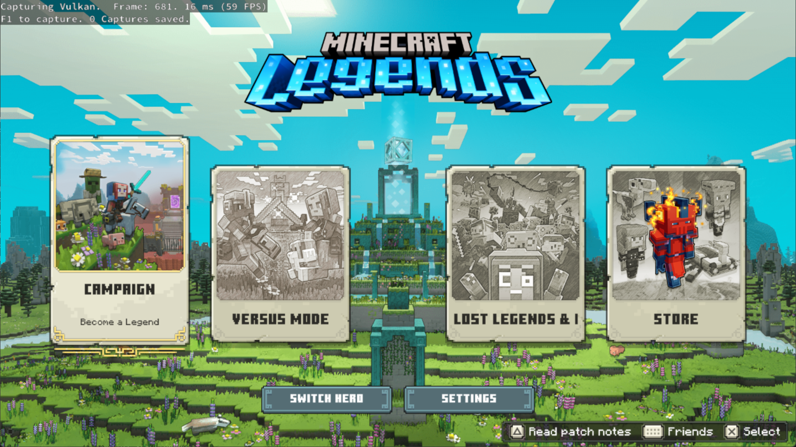
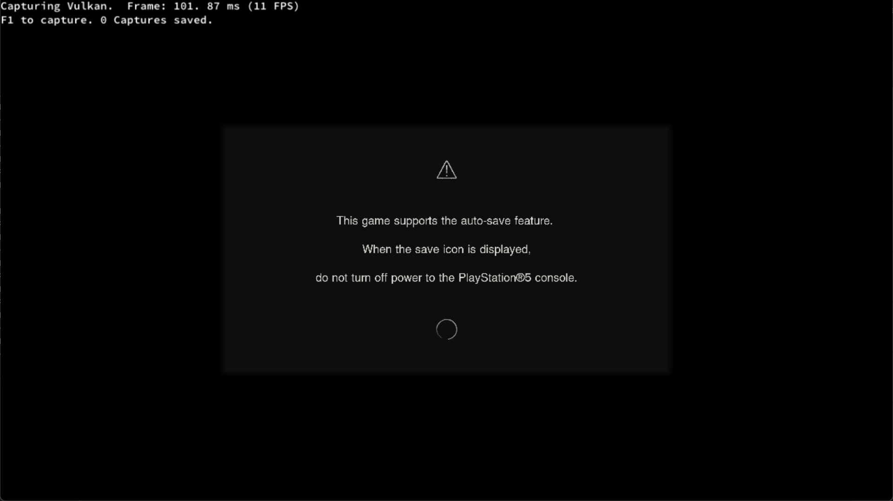

# KytyPlus

[](#system-requirements)
[](#current-status)
[](LICENSE)

**KytyPlus** is a KytyPS5-based PlayStation 5 emulator for **Windows, macOS, and Linux**. This repository is a
standalone project derived from [KytyPS5](https://github.com/KytyPS5/KytyPS5) (itself based on
[Kyty](https://github.com/InoriRus/Kyty)), with additional work aimed at **crash/boot reach**,
**HLE sysmodules**, and **iGPU-minded defaults** (intent only — iGPU behavior is **not yet verified**; see [iGPU status](#igpu-status)).

> [!CAUTION]
> **Early-development software.** Many games still crash, hang, black-screen, or render incorrectly.
> “Boots further” is not the same as “playable.” Do not expect AAA titles to run well.

## See it in action

Video of **Dead Cells booting to the main menu** on KytyPlus v1.8 (i7-9700K, RTX 4060 Ti, external HDD). Tested and recorded by [@CorpseSlayer](https://github.com/KytyPS5/KytyPS5/issues/127).

[▶ Watch on Google Drive](https://drive.google.com/file/d/1_7IoA9B2iV-H1VUGtYyxEGiN6PYI2vbu/view?pli=1)

> First-party footage of a commercial game reaching menu — the project's first confirmed boot-to-menu result. Past-menu state has not been tested.

---

## Disclaimers

### Affiliation and trademarks

- KytyPlus is **not affiliated with, endorsed by, or connected to** Sony Interactive Entertainment,
  PlayStation, or any Sony subsidiary.
- “PlayStation,” “PS5,” and related marks are trademarks of their respective owners.
- This project is an independent community emulator.

### Legal use only

- KytyPlus **does not include** games, game dumps, or Sony system firmware.
- Use **only** game files you have obtained **legally**.
- Do **not** ask maintainers for piracy links, firmware dumps, or copyrighted `sce_module` SPRXs.
- Distributing copyrighted dumps or firmware with this software is **illegal**.

### Firmware / modules

- KytyPlus uses an **HLE-first** approach: many titles do **not** require external low-level
  firmware modules to start.
- **Optional LLE support**: KytyPlus can parse official PS5 firmware update files (`.pup`) for
  Low-Level Emulation, significantly improving compatibility for complex titles.
- Firmware is **not included** with the emulator. Download it directly from Sony:
  **https://www.playstation.com/en-us/support/hardware/ps5/system-software/**
- To install: **Settings > Firmware > Install PS5 Firmware** and select the downloaded `.pup` file.
- KytyPlus does **not** distribute, include, or link to any Sony copyrighted material.

### No warranty

- Provided **as-is**, without warranty of any kind.
- Builds may break saves, drivers, or performance expectations. Use at your own risk.
- Binary releases must remain accompanied by (or clearly linked to) the corresponding **source**
  under **GPL-2.0**.

### What this project is / is not

| Is | Is not |
|----|--------|
| A compatibility-oriented KytyPS5 derivative | An official Sony product |
| Aimed at fewer hard EXITs and better boot reach | A claim that games are “fixed” or playable |
| Windows / macOS / Linux + Vulkan focused | A finished, stable emulator |
| Tester-oriented (logs welcome) | A place to request illegal files |

---

## Current status

Windows, macOS, and Linux. Vulkan 1.3 required (MoltenVK on macOS).

Upstream KytyPS5 can already boot a range of 2D/3D titles (UE4/5, Unity, custom engines). KytyPlus
builds on that with focused changes such as:

- Safer paths around several graphics **EXIT** crash clusters (layered render targets, storage
  texture encoding/swizzle, texture-cache alias retirement, sampled depth cubes, etc.)
- **HLE** improvements for sysmodule load/unload state (soft-success for unknown IDs where safe)
- Defaults and allocator tweaks **designed with integrated GPUs / UMA in mind** (e.g. Radeon 780M-class). iGPU behavior is **not yet verified** — testing reports on integrated hardware are especially welcome (see [iGPU status](#igpu-status))
- Present / pipeline-cache / shader-optimization adjustments for smoother local testing

Compatibility is still **early**. A title that no longer hits one known crash will often hit the
next unimplemented feature. Always test with a **fresh build** and attach logs when reporting.
> Help test KytyPlus: [share your results](https://github.com/Coder787-source/KytyPlus/discussions/2)
> or [file a compatibility report](https://github.com/Coder787-source/KytyPlus/issues/new?template=compatibility.yml).
> Browse existing results in the [compatibility list](docs/COMPATIBILITY.md).

---

## iGPU status

This project started on an integrated-GPU machine, so several defaults and allocator choices were
made **with iGPUs / UMA in mind**. That is a **design intent**, not a verified result.

- KytyPlus has **not yet been confirmed to boot or run on any integrated GPU**.
- An iGPU result would be a meaningful differentiator and is **actively sought**.

If you have an **iGPU system** (e.g. Radeon 780M, Intel Arc iGPU) **and legally obtained game dumps**,
a boot/menu report with logs and a rig description would be extremely valuable. Please share it in
[discussions](https://github.com/Coder787-source/KytyPlus/discussions/2) or as a
[compatibility report](https://github.com/Coder787-source/KytyPlus/issues/new?template=compatibility.yml).
Until such a report exists, treat iGPU support as **unproven**, not advertised.

## Press / Coverage

### KytyPlus

- **GameGaz** (大人のためのゲーム講座, JP) — [GameGaz Daily 2026.8.3](https://gamegaz.com/2026080345888/) —
  coverage of the KytyPlus v2.0 release.

### Upstream KytyPS5

These links cover the *upstream* KytyPS5 project (the lineage KytyPlus is derived from), not
KytyPlus itself. Listed for context only.

- **GameGaz** (大人のためのゲーム講座, JP) — [GameGaz Daily 2026.8.4](https://gamegaz.com/2026080445890/) —
  coverage of the KytyPS5 2026-08-03-e8752ac release.

> Coverage links are external and not affiliated with this project. They are listed for community
> reference only.
---

## Screenshots
Screenshots below are from the KytyPS5 lineage and illustrate early boot capability — not KytyPlus
playability guarantees.

<table align="center">
  <tr>
    <td align="center">
      <strong>Disgaea 6</strong><br>
      
    </td>
    <td align="center">
      <strong>Dreaming Sarah</strong><br>
      
    </td>
  </tr>
  <tr>
    <td align="center">
      <strong>Neptunia ReVerse</strong><br>
      
    </td>
    <td align="center">
      <strong>SILENT HILL: The Short Message</strong><br>
      
    </td>
  </tr>
  <tr>
    <td align="center">
      <strong>Hellboy Web of Wyrd </strong><br>
      
    </td>
    <td align="center">
      <strong>Paleo Pines</strong><br>
      
    </td>
  </tr>
</table>


---

## System requirements

### Runtime

- Windows 10 (1803+) or Windows 11, **64-bit** (Vulkan 1.3)
- CPU: x86-64
- macOS 12+ (Vulkan 1.3 via MoltenVK)
- Linux (Vulkan 1.3)
- GPU: **Vulkan 1.3** capable, with current drivers (AMD / NVIDIA / Intel)
- RAM: 16 GB minimum; **32 GB recommended** (especially on iGPU / UMA systems)

### What you need to run a game

- A **legally obtained** dumped game or demo directory, typically containing:
  - `eboot.bin` (Prospero ELF; sometimes named `.elf`)
  - Supporting files (`sce_sys`, data folders, etc. as required by the title)
- KytyPlus expects **Prospero / FreeBSD-OSABI** ELFs. Generic homebrew SDK ELFs with System V OSABI
  are often rejected (`elf is not valid` / `EI_OSABI != ELFOSABI_FREEBSD`).

---
> **Important:** Before using KytyPlus, please read our [Legal Disclaimer](./DISCLAIMER.md) regarding trademarks and the legal acquisition of guest system files.

## Install options

### Option A — Download a Release build (testers)

1. Open the repository **Releases** page.
2. Download the latest install zip (full `_Build/windows/install` tree — **not** a lone `.exe`).
3. Extract somewhere writable (example: `C:\KytyPlus\`).
4. Run `launcher.exe` or `kyty_emulator.exe` as described in [Running](#running).

> [!IMPORTANT]
> Under GPL-2.0, redistributed binaries must be paired with corresponding source availability.
> Prefer official project Releases that point at a git tag/commit.

### Option B — Build from source

#### Windows

##### Build dependencies

| Dependency | Notes |
|------------|--------|
| Git | Submodules required |
| CMake 3.12+ | On PATH |
| Ninja | On PATH |
| Visual Studio 2022 or Build Tools | **Desktop C++** + **C++ Clang tools for Windows** (`clang-cl`) |
| Qt 6 (MSVC 2022 64-bit) | Widgets, Network, Concurrent (e.g. `C:\Qt\6.10.3\msvc2022_64`) |
| Vulkan SDK | Provides `glslangValidator` (required at configure time) |

`cl.exe` alone is **not** supported — use **`clang-cl`**.

##### Configure and build

Open an **x64 Native Tools / Developer** shell for VS 2022, then:

```powershell
cd C:\path\to\KytyPlus

git submodule update --init --recursive

cmake -S src -B _Build/windows -G Ninja `
  -DCMAKE_BUILD_TYPE=Release `
  -DCMAKE_C_COMPILER=clang-cl `
  -DCMAKE_CXX_COMPILER=clang-cl `
  -DCMAKE_PREFIX_PATH="C:/Qt/6.10.3/msvc2022_64"

cmake --build _Build/windows --target launcher
cmake --install _Build/windows --prefix _Build/windows/install
```

Replace the Qt path with your installed version. After a successful install you should have:

```text
_Build\windows\install\launcher.exe
_Build\windows\install\kyty_emulator.exe
```

(plus Qt/runtime DLLs staged next to them)

#### Visual Studio Code

A CMake Tools setup lives in [`.vscode`](.vscode):

1. Install **CMake Tools** and **C/C++** extensions.
2. Set `CMAKE_PREFIX_PATH` in [`.vscode/settings.json`](.vscode/settings.json) to your Qt path.
3. Set `--game` in [`.vscode/launch.json`](.vscode/launch.json) for debugging.
4. Configure/build from an x64 VS developer environment.

#### macOS

Built and tested on **macOS 15** with **Xcode 26** and **Qt 6.10.3** (clang_64). macOS uses
**MoltenVK** to provide Vulkan 1.3; the CI build bundles `libMoltenVK.dylib` next to the binaries.

##### Build dependencies

| Dependency | Notes |
|------------|--------|
| Git | Submodules required |
| CMake 3.12+ | On PATH |
| Ninja | `brew install ninja` |
| Xcode 26 (clang++) | Command Line Tools or full Xcode |
| Qt 6 (clang_64) | Widgets, Network, Concurrent (e.g. `~/Qt/6.10.3/macos`) |
| glslang | `brew install glslang` (provides `glslangValidator`) |
| MoltenVK | Optional at build time; required at **runtime**. CI bundles v1.4.2 |

##### Configure and build

```bash
cd /path/to/KytyPlus

git submodule update --init --recursive

cmake -S src -B _Build/macos -G Ninja \
  -DCMAKE_BUILD_TYPE=Release \
  -DCMAKE_OSX_ARCHITECTURES=x86_64 \
  -DCMAKE_C_COMPILER=clang \
  -DCMAKE_CXX_COMPILER=clang++ \
  -DCMAKE_PREFIX_PATH="$HOME/Qt/6.10.3/macos"

cmake --build _Build/macos --target launcher
cmake --install _Build/macos --prefix _Build/macos/install
```

To run the built binaries, place `libMoltenVK.dylib` next to `kyty_emulator` (or install the
Vulkan SDK). After a successful install you should have:

```text
_Build/macos/install/launcher
_Build/macos/install/kyty_emulator
```

> [!NOTE]
> The CI build targets **x86_64** (`-DCMAKE_OSX_ARCHITECTURES=x86_64`). Apple Silicon users can
> run the x86_64 build under Rosetta 2; a native arm64 build is not yet provided by CI.

#### Linux

Built and tested on **Ubuntu 24.04** with **Clang** and **Qt 6.10.3** (linux_gcc_64). Vulkan 1.3
is provided by your system Mesa/NVIDIA drivers.

##### Build dependencies

```bash
sudo apt-get update
sudo apt-get install --no-install-recommends --yes \
  clang lld ninja-build cmake git \
  glslang-tools \
  libgl1-mesa-dev libwayland-dev wayland-protocols \
  libx11-dev libxext-dev libxcursor-dev libxfixes-dev \
  libxi-dev libxrandr-dev libxkbcommon-dev libxss-dev \
  libasound2-dev libpulse-dev libudev-dev libdbus-1-dev
```

Plus **Qt 6** (Widgets, Network, Concurrent), e.g. `~/Qt/6.10.3/gcc_64`.

##### Configure and build

```bash
cd /path/to/KytyPlus

git submodule update --init --recursive

cmake -S src -B _Build/linux -G Ninja \
  -DCMAKE_BUILD_TYPE=Release \
  -DCMAKE_C_COMPILER=clang \
  -DCMAKE_CXX_COMPILER=clang++ \
  -DCMAKE_PREFIX_PATH="$HOME/Qt/6.10.3/gcc_64"

cmake --build _Build/linux --target launcher
cmake --install _Build/linux --prefix _Build/linux/install
```

After a successful install you should have:

```text
_Build/linux/install/launcher
_Build/linux/install/kyty_emulator
```

Qt plugins and shared libraries are staged under `_Build/linux/install/lib` and found via an
`$ORIGIN/lib` RPATH, so run the binaries from the install prefix directly.

---

## Running

Update GPU drivers before reporting graphics bugs.

### Graphical launcher

```powershell
.\_Build\windows\install\launcher.exe
```

1. Open global settings and add a folder that contains your dumped games.
2. The launcher searches recursively for directories with **`eboot.bin`**.
3. Select a game and run it.

### Command line

Game **directory** (loads `/app0/eboot.bin`):

```powershell
.\_Build\windows\install\kyty_emulator.exe --game "D:\Games\MyDump"
```

Specific **ELF** / `eboot.bin` (parent folder becomes `/app0`):

```powershell
.\_Build\windows\install\kyty_emulator.exe --game "D:\Games\MyDump\eboot.bin"
```

```powershell
.\_Build\windows\install\kyty_emulator.exe --game "D:\Games\MyDump\something.elf"
```

See all options:

```powershell
.\_Build\windows\install\kyty_emulator.exe --help
```

### Tips

- Keep dumps on a fast local disk; long paths and permission-locked folders cause avoidable pain.
- For bug reports, enable logging as needed and attach the **full** log, especially the final
  `--- Error ---` block and stack trace.
- iGPU / UMA systems: shared memory pressure is normal. **Note:** KytyPlus has **not yet been verified to boot or run on any integrated GPU** — iGPU-friendly defaults are by design intent, not confirmed behavior (see [iGPU status](#igpu-status)).

---

## Reporting bugs

1. Search existing issues first.
2. Include: game title, serial/title ID if known, KytyPlus commit or Release name, GPU/CPU/RAM, OS.
3. Attach the complete log file.
4. Describe exact steps (boot → menu → crash, etc.).

Expect crashes and incomplete features. Actionable reports with logs help more than “doesn’t work.”

---

## Contributing

- Prefer focused changes that build on Windows with the documented toolchain.
- Open an issue before large redesigns.
- Keep PRs reviewable; include tests when practical.

### Formatting

```powershell
python -m pip install pre-commit
python -m pre_commit install --install-hooks
```

Formats staged `.cpp`, `.h`, and `.inc` files under `src`.

### AI use

AI tools may be used for research and assistance. Contributors must review, understand, and test
everything they submit. Disclose meaningful AI involvement in pull requests. Unverified generated
dumps may be closed without review.

---

## Developer map

PS5 graphics are AMD RDNA 2–based. Useful reference:
[RDNA 2 ISA Guide (70648)](https://docs.amd.com/v/u/en-US/rdna2-shader-instruction-set-architecture).

| Area | Path |
|------|------|
| Shader decode / IR / SPIR-V | [`src/graphics/shader/recompiler`](src/graphics/shader/recompiler) |
| Guest GPU (Prospero) | [`src/graphics/guest_gpu`](src/graphics/guest_gpu) |
| Host Vulkan backend | [`src/graphics/host_gpu`](src/graphics/host_gpu) |
| Tests | [`tests`](tests) |

Renderer target: **Vulkan 1.3**.

---

## License and credits

KytyPlus (like KytyPS5) is licensed under the
[GNU General Public License version 2](LICENSE) (`GPL-2.0-only`).

### Upstream lineage

- [KytyPS5/KytyPS5](https://github.com/KytyPS5/KytyPS5) — primary upstream this tree is based on
- [InoriRus/Kyty](https://github.com/InoriRus/Kyty) — original Kyty project (MIT); see
  [`LICENSES/Kyty-MIT.txt`](LICENSES/Kyty-MIT.txt)
- [shadps4-emu/shadPS4](https://github.com/shadps4-emu/shadPS4) — reference for memory-model
  understanding and AVPlayer-related work in the lineage

Third-party components remain under their own licenses as included in the tree.

When publishing binaries, comply with GPL-2.0: provide Corresponding Source for the exact build.

---

## FAQ

**Can I run a raw `.elf`?**  
Yes, via `--game path\to\file.elf`, if it is a valid Prospero ELF. Homebrew SDK ELFs with the wrong
OSABI are often rejected.

**Do I need PS5 firmware?**  
Not for the intended HLE path. Do not request or redistribute firmware here.

**Is game X playable?**  
Assume **no** until a tester confirms with a specific build. Prefer “boots / menu / ingame crash”
labels over “playable.”

**Why not ship only `kyty_emulator.exe`?**  
It depends on staged DLLs and data from the install prefix, and GPL requires source availability
with binaries.
